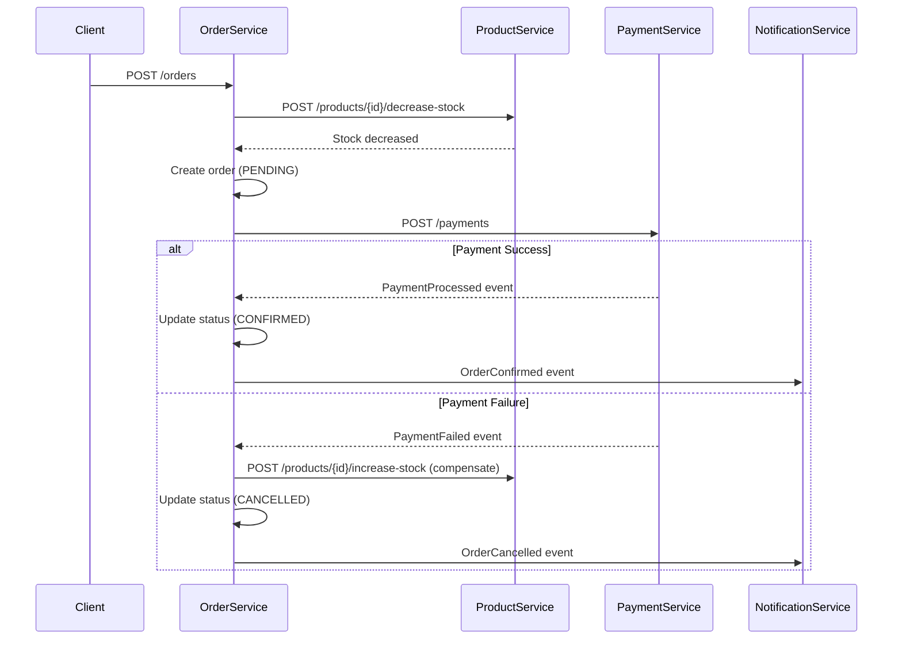

# Order Service - Design Specification

**Data**: 2026-03-11 16:40
**Fase**: SDD Phase 3 - DESIGN
**Serviço**: Order Service
**Versão**: 1.0.0-SNAPSHOT

---

## 1. Arquitetura Geral

### 1.1 Hexagonal Architecture

```
order-service/
├── domain/                    (Core Business - ZERO framework dependencies)
│   ├── model/                 (Aggregates, Entities, Value Objects)
│   │   ├── Order.java         (Aggregate Root)
│   │   ├── OrderItem.java     (Entity)
│   │   ├── OrderId.java       (Value Object)
│   │   ├── CustomerId.java    (Value Object)
│   │   ├── Money.java         (Value Object - shared)
│   │   ├── OrderStatus.java   (Enum)
│   │   └── OrderSnapshot.java (Memento pattern)
│   ├── service/               (Domain Services)
│   │   ├── OrderPricingService.java
│   │   ├── OrderValidationService.java
│   │   └── SagaOrchestrator.java
│   ├── repository/            (Ports - interfaces)
│   │   └── OrderRepository.java
│   ├── event/                 (Domain Events)
│   │   ├── OrderCreated.java
│   │   ├── OrderStatusChanged.java
│   │   └── OrderCancelled.java
│   └── exception/             (Domain Exceptions)
│       ├── OrderNotFoundException.java
│       ├── InvalidOrderStateException.java
│       └── InsufficientStockException.java
│
├── application/               (Use Cases & Orchestration)
│   ├── usecase/               (Application Services)
│   │   ├── CreateOrderUseCase.java
│   │   ├── GetOrderUseCase.java
│   │   ├── ListOrdersUseCase.java
│   │   ├── CancelOrderUseCase.java
│   │   └── ProcessPaymentResultUseCase.java
│   ├── dto/                   (Request/Response DTOs)
│   │   ├── request/
│   │   │   ├── CreateOrderRequest.java
│   │   │   ├── OrderItemRequest.java
│   │   │   └── CancelOrderRequest.java
│   │   └── response/
│   │       ├── OrderResponse.java
│   │       ├── OrderItemResponse.java
│   │       └── OrderSummaryResponse.java
│   ├── mapper/                (Domain ↔ DTO)
│   │   └── OrderMapper.java   (MapStruct)
│   └── port/                  (Outbound Ports)
│       ├── ProductServicePort.java
│       ├── PaymentServicePort.java
│       └── EventPublisherPort.java
│
└── infrastructure/            (Adapters & Framework)
    ├── persistence/           (Database Adapter)
    │   ├── entity/
    │   │   ├── OrderJpaEntity.java
    │   │   └── OrderItemJpaEntity.java
    │   ├── repository/
    │   │   ├── OrderJpaRepository.java
    │   │   └── OrderRepositoryImpl.java
    │   └── mapper/
    │       └── OrderJpaMapper.java
    ├── rest/                  (REST Adapter)
    │   ├── controller/
    │   │   └── OrderController.java
    │   └── exception/
    │       └── OrderExceptionHandler.java
    ├── messaging/             (Event Adapter)
    │   ├── publisher/
    │   │   └── OrderEventPublisher.java
    │   ├── consumer/
    │   │   └── PaymentEventConsumer.java
    │   └── config/
    │       └── RabbitMQConfig.java
    ├── integration/           (External Services)
    │   ├── ProductServiceClient.java
    │   ├── PaymentServiceClient.java
    │   └── config/
    │       └── FeignConfig.java
    └── config/                (Spring Configuration)
        ├── DatabaseConfig.java
        ├── CacheConfig.java
        └── SwaggerConfig.java
```

---

## 2. Domain Model

### 2.1 Order (Aggregate Root)

```java
public class Order {
    private OrderId id;
    private CustomerId customerId;
    private List<OrderItem> items;
    private Money totalAmount;
    private OrderStatus status;
    private LocalDateTime createdAt;
    private LocalDateTime updatedAt;
    private String cancellationReason;
    
    // Factory Methods
    public static Order create(CustomerId customerId, List<OrderItem> items);
    
    // Business Methods
    public void confirm();
    public void cancel(String reason);
    public Money calculateTotal();
    public boolean canBeCancelled();
    public void addItem(OrderItem item);
    public void removeItem(ProductId productId);
    
    // Events
    public List<DomainEvent> getUncommittedEvents();
    public void markEventsAsCommitted();
}
```

### 2.2 OrderItem (Entity)

```java
public class OrderItem {
    private ProductId productId;
    private String productName;
    private int quantity;
    private Money unitPrice;
    private Money totalPrice;
    
    // Factory Method
    public static OrderItem create(ProductId productId, String productName, 
                                  int quantity, Money unitPrice);
    
    // Business Methods
    public Money calculateTotal();
    public void updateQuantity(int newQuantity);
}
```

### 2.3 Value Objects

```java
// OrderId
public record OrderId(String value) {
    public static OrderId generate();
    public static OrderId from(String value);
}

// CustomerId
public record CustomerId(String value) {
    public static CustomerId from(String value);
}

// OrderStatus
public enum OrderStatus {
    PENDING,
    CONFIRMED,
    CANCELLED,
    DELIVERED;
    
    public boolean canTransitionTo(OrderStatus newStatus);
}
```

---

## 3. SAGA Orchestration Pattern

### 3.1 SagaOrchestrator (Domain Service)

```java
@Component
public class SagaOrchestrator {
    
    public void orchestrateOrderCreation(Order order) {
        // Step 1: Decrease stock
        // Step 2: Process payment
        // Step 3: Confirm order or compensate
    }
    
    public void handlePaymentSuccess(OrderId orderId, PaymentId paymentId) {
        // Confirm order
        // Publish OrderConfirmed event
    }
    
    public void handlePaymentFailure(OrderId orderId, String reason) {
        // Compensate: increase stock
        // Cancel order
        // Publish OrderCancelled event
    }
}
```

### 3.2 Saga Steps



---

## 4. API Design

### 4.1 REST Endpoints

```yaml
# Create Order
POST /api/v1/orders
Content-Type: application/json
Authorization: Bearer {jwt}

Request:
{
  "customerId": "customer-123",
  "items": [
    {
      "productId": "product-456",
      "quantity": 2
    }
  ]
}

Response: 201 Created
{
  "id": "order-789",
  "customerId": "customer-123",
  "items": [
    {
      "productId": "product-456",
      "productName": "iPhone 15",
      "quantity": 2,
      "unitPrice": 999.99,
      "totalPrice": 1999.98
    }
  ],
  "totalAmount": 1999.98,
  "status": "PENDING",
  "createdAt": "2026-03-11T16:40:00Z"
}

# Get Order
GET /api/v1/orders/{id}
Authorization: Bearer {jwt}

Response: 200 OK
{
  "id": "order-789",
  "customerId": "customer-123",
  "items": [...],
  "totalAmount": 1999.98,
  "status": "CONFIRMED",
  "createdAt": "2026-03-11T16:40:00Z",
  "updatedAt": "2026-03-11T16:41:00Z"
}

# List Orders
GET /api/v1/orders?page=0&size=20&status=CONFIRMED
Authorization: Bearer {jwt}

Response: 200 OK
{
  "content": [
    {
      "id": "order-789",
      "totalAmount": 1999.98,
      "status": "CONFIRMED",
      "createdAt": "2026-03-11T16:40:00Z"
    }
  ],
  "page": 0,
  "size": 20,
  "totalElements": 1,
  "totalPages": 1
}

# Cancel Order
DELETE /api/v1/orders/{id}
Authorization: Bearer {jwt}

Request:
{
  "reason": "Customer requested cancellation"
}

Response: 204 No Content
```

### 4.2 Event Contracts

```yaml
# OrderCreated Event
{
  "eventId": "uuid",
  "eventType": "OrderCreated",
  "timestamp": "2026-03-11T16:40:00Z",
  "aggregateId": "order-789",
  "payload": {
    "orderId": "order-789",
    "customerId": "customer-123",
    "items": [
      {
        "productId": "product-456",
        "quantity": 2,
        "unitPrice": 999.99
      }
    ],
    "totalAmount": 1999.98
  },
  "metadata": {
    "correlationId": "correlation-123",
    "userId": "customer-123"
  }
}

# OrderStatusChanged Event
{
  "eventId": "uuid",
  "eventType": "OrderStatusChanged",
  "timestamp": "2026-03-11T16:41:00Z",
  "aggregateId": "order-789",
  "payload": {
    "orderId": "order-789",
    "previousStatus": "PENDING",
    "newStatus": "CONFIRMED",
    "reason": "Payment processed successfully"
  },
  "metadata": {
    "correlationId": "correlation-123"
  }
}
```

---

## 5. Database Design

### 5.1 PostgreSQL Schema

```sql
-- Orders table
CREATE TABLE orders (
    id VARCHAR(36) PRIMARY KEY,
    customer_id VARCHAR(36) NOT NULL,
    total_amount DECIMAL(10,2) NOT NULL,
    status VARCHAR(20) NOT NULL,
    cancellation_reason TEXT,
    created_at TIMESTAMP NOT NULL DEFAULT CURRENT_TIMESTAMP,
    updated_at TIMESTAMP NOT NULL DEFAULT CURRENT_TIMESTAMP,
    version INTEGER NOT NULL DEFAULT 0
);

-- Order items table
CREATE TABLE order_items (
    id VARCHAR(36) PRIMARY KEY,
    order_id VARCHAR(36) NOT NULL,
    product_id VARCHAR(36) NOT NULL,
    product_name VARCHAR(255) NOT NULL,
    quantity INTEGER NOT NULL,
    unit_price DECIMAL(10,2) NOT NULL,
    total_price DECIMAL(10,2) NOT NULL,
    FOREIGN KEY (order_id) REFERENCES orders(id)
);

-- Indexes
CREATE INDEX idx_orders_customer_id ON orders(customer_id);
CREATE INDEX idx_orders_status ON orders(status);
CREATE INDEX idx_orders_created_at ON orders(created_at);
CREATE INDEX idx_order_items_order_id ON order_items(order_id);
CREATE INDEX idx_order_items_product_id ON order_items(product_id);
```

### 5.2 JPA Entities

```java
@Entity
@Table(name = "orders")
public class OrderJpaEntity {
    @Id
    private String id;
    
    @Column(name = "customer_id", nullable = false)
    private String customerId;
    
    @Column(name = "total_amount", nullable = false, precision = 10, scale = 2)
    private BigDecimal totalAmount;
    
    @Enumerated(EnumType.STRING)
    @Column(nullable = false)
    private OrderStatus status;
    
    @OneToMany(mappedBy = "order", cascade = CascadeType.ALL, fetch = FetchType.LAZY)
    private List<OrderItemJpaEntity> items = new ArrayList<>();
    
    @Column(name = "cancellation_reason")
    private String cancellationReason;
    
    @CreationTimestamp
    @Column(name = "created_at", nullable = false)
    private LocalDateTime createdAt;
    
    @UpdateTimestamp
    @Column(name = "updated_at", nullable = false)
    private LocalDateTime updatedAt;
    
    @Version
    private Integer version;
}

@Entity
@Table(name = "order_items")
public class OrderItemJpaEntity {
    @Id
    private String id;
    
    @ManyToOne(fetch = FetchType.LAZY)
    @JoinColumn(name = "order_id", nullable = false)
    private OrderJpaEntity order;
    
    @Column(name = "product_id", nullable = false)
    private String productId;
    
    @Column(name = "product_name", nullable = false)
    private String productName;
    
    @Column(nullable = false)
    private Integer quantity;
    
    @Column(name = "unit_price", nullable = false, precision = 10, scale = 2)
    private BigDecimal unitPrice;
    
    @Column(name = "total_price", nullable = false, precision = 10, scale = 2)
    private BigDecimal totalPrice;
}
```

---

## 6. Integration Design

### 6.1 Product Service Integration

```java
@FeignClient(name = "product-service", url = "${services.product.url}")
public interface ProductServiceClient {
    
    @GetMapping("/api/v1/products/{id}")
    ProductDto getProduct(@PathVariable String id);
    
    @PostMapping("/api/v1/products/{id}/decrease-stock")
    void decreaseStock(@PathVariable String id, @RequestBody StockOperationRequest request);
    
    @PostMapping("/api/v1/products/{id}/increase-stock")
    void increaseStock(@PathVariable String id, @RequestBody StockOperationRequest request);
}

@Component
public class ProductServiceAdapter implements ProductServicePort {
    
    private final ProductServiceClient client;
    
    @Override
    @CircuitBreaker(name = "product-service", fallbackMethod = "getProductFallback")
    @Retry(name = "product-service")
    public Product getProduct(ProductId productId) {
        ProductDto dto = client.getProduct(productId.value());
        return ProductMapper.toDomain(dto);
    }
    
    public Product getProductFallback(ProductId productId, Exception ex) {
        throw new ProductServiceUnavailableException("Product service is unavailable", ex);
    }
}
```

### 6.2 Payment Service Integration

```java
@FeignClient(name = "payment-service", url = "${services.payment.url}")
public interface PaymentServiceClient {
    
    @PostMapping("/api/v1/payments")
    PaymentDto processPayment(@RequestBody ProcessPaymentRequest request);
    
    @PostMapping("/api/v1/payments/{id}/refund")
    RefundDto refundPayment(@PathVariable String id, @RequestBody RefundRequest request);
}
```

### 6.3 Event Publishing

```java
@Component
public class OrderEventPublisher implements EventPublisherPort {
    
    private final RabbitTemplate rabbitTemplate;
    
    @Override
    public void publishOrderCreated(OrderCreated event) {
        rabbitTemplate.convertAndSend("order.events", "order.created", event);
    }
    
    @Override
    public void publishOrderStatusChanged(OrderStatusChanged event) {
        rabbitTemplate.convertAndSend("order.events", "order.status.changed", event);
    }
    
    @Override
    public void publishOrderCancelled(OrderCancelled event) {
        rabbitTemplate.convertAndSend("order.events", "order.cancelled", event);
    }
}
```

---

## 7. Caching Strategy

### 7.1 Cache-Aside Pattern

```java
@Component
public class OrderCacheService {
    
    private final RedisTemplate<String, OrderJpaEntity> redisTemplate;
    private static final String CACHE_KEY_PREFIX = "order:";
    private static final Duration TTL = Duration.ofMinutes(10);
    
    public Optional<OrderJpaEntity> get(String orderId) {
        String key = CACHE_KEY_PREFIX + orderId;
        OrderJpaEntity cached = redisTemplate.opsForValue().get(key);
        return Optional.ofNullable(cached);
    }
    
    public void put(String orderId, OrderJpaEntity order) {
        String key = CACHE_KEY_PREFIX + orderId;
        redisTemplate.opsForValue().set(key, order, TTL);
    }
    
    public void evict(String orderId) {
        String key = CACHE_KEY_PREFIX + orderId;
        redisTemplate.delete(key);
    }
}
```

---

## 8. Error Handling

### 8.1 Exception Hierarchy

```java
// Domain Exceptions
public class OrderNotFoundException extends DomainException {
    public OrderNotFoundException(String orderId) {
        super("Order not found: " + orderId);
    }
}

public class InvalidOrderStateException extends DomainException {
    public InvalidOrderStateException(String message) {
        super(message);
    }
}

public class InsufficientStockException extends DomainException {
    public InsufficientStockException(String productId, int requested, int available) {
        super(String.format("Insufficient stock for product %s. Requested: %d, Available: %d", 
              productId, requested, available));
    }
}

// Infrastructure Exceptions
public class ProductServiceUnavailableException extends InfrastructureException {
    public ProductServiceUnavailableException(String message, Throwable cause) {
        super(message, cause);
    }
}
```

### 8.2 Global Exception Handler

```java
@RestControllerAdvice
public class OrderExceptionHandler {
    
    @ExceptionHandler(OrderNotFoundException.class)
    public ResponseEntity<ErrorResponse> handleOrderNotFound(OrderNotFoundException ex) {
        return ResponseEntity.status(HttpStatus.NOT_FOUND)
            .body(new ErrorResponse("ORDER_NOT_FOUND", ex.getMessage()));
    }
    
    @ExceptionHandler(InvalidOrderStateException.class)
    public ResponseEntity<ErrorResponse> handleInvalidOrderState(InvalidOrderStateException ex) {
        return ResponseEntity.status(HttpStatus.BAD_REQUEST)
            .body(new ErrorResponse("INVALID_ORDER_STATE", ex.getMessage()));
    }
    
    @ExceptionHandler(InsufficientStockException.class)
    public ResponseEntity<ErrorResponse> handleInsufficientStock(InsufficientStockException ex) {
        return ResponseEntity.status(HttpStatus.BAD_REQUEST)
            .body(new ErrorResponse("INSUFFICIENT_STOCK", ex.getMessage()));
    }
}
```

---

## 9. Configuration

### 9.1 Application Properties

```yaml
# application.yml
spring:
  application:
    name: order-service
  
  datasource:
    url: jdbc:postgresql://localhost:5432/order_db
    username: ${DB_USERNAME:order_user}
    password: ${DB_PASSWORD:order_pass}
    driver-class-name: org.postgresql.Driver
  
  jpa:
    hibernate:
      ddl-auto: validate
    show-sql: false
    properties:
      hibernate:
        dialect: org.hibernate.dialect.PostgreSQLDialect
        format_sql: true
  
  redis:
    host: ${REDIS_HOST:localhost}
    port: ${REDIS_PORT:6379}
    timeout: 2000ms
    lettuce:
      pool:
        max-active: 8
        max-idle: 8
        min-idle: 0
  
  rabbitmq:
    host: ${RABBITMQ_HOST:localhost}
    port: ${RABBITMQ_PORT:5672}
    username: ${RABBITMQ_USERNAME:guest}
    password: ${RABBITMQ_PASSWORD:guest}

# Services integration
services:
  product:
    url: ${PRODUCT_SERVICE_URL:http://localhost:8081}
  payment:
    url: ${PAYMENT_SERVICE_URL:http://localhost:8083}

# Circuit Breaker
resilience4j:
  circuitbreaker:
    instances:
      product-service:
        failure-rate-threshold: 50
        wait-duration-in-open-state: 60s
        sliding-window-size: 10
        minimum-number-of-calls: 5
      payment-service:
        failure-rate-threshold: 30
        wait-duration-in-open-state: 30s
        sliding-window-size: 20
        minimum-number-of-calls: 10

# Logging
logging:
  level:
    com.enterprise.order: DEBUG
    org.springframework.web: INFO
  pattern:
    console: "%d{yyyy-MM-dd HH:mm:ss} [%thread] %-5level [%X{correlationId}] %logger{36} - %msg%n"
```

---

## 10. Testing Strategy

### 10.1 Test Pyramid

```
E2E Tests (10%)
├── OrderFlowE2ETest.java
└── SagaCompensationE2ETest.java

Integration Tests (30%)
├── OrderRepositoryIT.java
├── OrderControllerIT.java
├── ProductServiceIntegrationIT.java
└── EventPublishingIT.java

Unit Tests (60%)
├── Domain Tests
│   ├── OrderTest.java
│   ├── OrderItemTest.java
│   └── SagaOrchestratorTest.java
├── Application Tests
│   ├── CreateOrderUseCaseTest.java
│   ├── GetOrderUseCaseTest.java
│   └── CancelOrderUseCaseTest.java
└── Infrastructure Tests
    ├── OrderRepositoryImplTest.java
    └── OrderEventPublisherTest.java
```

### 10.2 Test Scenarios

```java
// Domain Tests
@Test
void createOrder_WhenValidItems_ShouldCreatePendingOrder() {
    // Given
    CustomerId customerId = CustomerId.from("customer-123");
    List<OrderItem> items = List.of(
        OrderItem.create(ProductId.from("product-456"), "iPhone 15", 2, Money.brl(999.99))
    );
    
    // When
    Order order = Order.create(customerId, items);
    
    // Then
    assertThat(order.getStatus()).isEqualTo(OrderStatus.PENDING);
    assertThat(order.getTotalAmount()).isEqualTo(Money.brl(1999.98));
    assertThat(order.getUncommittedEvents()).hasSize(1);
    assertThat(order.getUncommittedEvents().get(0)).isInstanceOf(OrderCreated.class);
}

// Integration Tests with Testcontainers
@SpringBootTest
@Testcontainers
class OrderRepositoryIT {
    
    @Container
    static PostgreSQLContainer<?> postgres = new PostgreSQLContainer<>("postgres:16-alpine")
        .withDatabaseName("order_test")
        .withUsername("test")
        .withPassword("test");
    
    @Test
    void save_WhenValidOrder_ShouldPersistSuccessfully() {
        // Test implementation
    }
}
```

---

## 11. Observability

### 11.1 Structured Logging

```java
@Component
public class OrderService {
    
    private static final Logger log = LoggerFactory.getLogger(OrderService.class);
    
    public Order createOrder(CreateOrderRequest request) {
        log.info("Creating order for customer: {}", request.getCustomerId());
        
        try {
            Order order = Order.create(/* ... */);
            log.info("Order created successfully: orderId={}, totalAmount={}", 
                    order.getId(), order.getTotalAmount());
            return order;
        } catch (Exception ex) {
            log.error("Failed to create order for customer: {}", request.getCustomerId(), ex);
            throw ex;
        }
    }
}
```

### 11.2 Metrics

```java
@Component
public class OrderMetrics {
    
    private final Counter ordersCreated;
    private final Counter ordersConfirmed;
    private final Counter ordersCancelled;
    private final Timer orderProcessingTime;
    
    public OrderMetrics(MeterRegistry meterRegistry) {
        this.ordersCreated = Counter.builder("orders.created")
            .description("Number of orders created")
            .register(meterRegistry);
        // ... other metrics
    }
    
    public void recordOrderCreated() {
        ordersCreated.increment();
    }
}
```

### 11.3 Health Checks

```java
@Component
public class OrderServiceHealthIndicator implements HealthIndicator {
    
    private final OrderRepository orderRepository;
    private final ProductServiceClient productServiceClient;
    
    @Override
    public Health health() {
        try {
            // Check database connectivity
            orderRepository.count();
            
            // Check external service connectivity
            productServiceClient.healthCheck();
            
            return Health.up()
                .withDetail("database", "UP")
                .withDetail("product-service", "UP")
                .build();
        } catch (Exception ex) {
            return Health.down()
                .withDetail("error", ex.getMessage())
                .build();
        }
    }
}
```

---

## 12. Security

### 12.1 JWT Authentication

```java
@RestController
@RequestMapping("/api/v1/orders")
@PreAuthorize("hasRole('USER')")
public class OrderController {
    
    @PostMapping
    @PreAuthorize("@orderSecurityService.canCreateOrder(authentication.name, #request)")
    public ResponseEntity<OrderResponse> createOrder(@RequestBody CreateOrderRequest request) {
        // Implementation
    }
    
    @GetMapping("/{id}")
    @PreAuthorize("@orderSecurityService.canAccessOrder(authentication.name, #id)")
    public ResponseEntity<OrderResponse> getOrder(@PathVariable String id) {
        // Implementation
    }
}

@Component
public class OrderSecurityService {
    
    public boolean canCreateOrder(String userId, CreateOrderRequest request) {
        return userId.equals(request.getCustomerId());
    }
    
    public boolean canAccessOrder(String userId, String orderId) {
        // Check if user owns the order
        return orderRepository.findById(orderId)
            .map(order -> order.getCustomerId().equals(userId))
            .orElse(false);
    }
}
```

---

## 13. Deployment

### 13.1 Docker Configuration

```dockerfile
# Dockerfile
FROM openjdk:17-jdk-slim

WORKDIR /app

COPY target/order-service-*.jar app.jar

EXPOSE 8082

ENTRYPOINT ["java", "-jar", "app.jar"]
```

### 13.2 Kubernetes Manifests

```yaml
# deployment.yaml
apiVersion: apps/v1
kind: Deployment
metadata:
  name: order-service
  namespace: enterprise-order
spec:
  replicas: 3
  selector:
    matchLabels:
      app: order-service
  template:
    metadata:
      labels:
        app: order-service
    spec:
      containers:
      - name: order-service
        image: enterprise/order-service:latest
        ports:
        - containerPort: 8082
        env:
        - name: DB_USERNAME
          valueFrom:
            secretKeyRef:
              name: order-db-secret
              key: username
        - name: DB_PASSWORD
          valueFrom:
            secretKeyRef:
              name: order-db-secret
              key: password
        resources:
          requests:
            memory: "512Mi"
            cpu: "250m"
          limits:
            memory: "1Gi"
            cpu: "500m"
        livenessProbe:
          httpGet:
            path: /actuator/health
            port: 8082
          initialDelaySeconds: 30
          periodSeconds: 10
        readinessProbe:
          httpGet:
            path: /actuator/health/readiness
            port: 8082
          initialDelaySeconds: 5
          periodSeconds: 5
```

---

## 14. Performance Considerations

### 14.1 Database Optimization

- **Indexes**: Customer ID, Status, Created Date
- **Connection Pooling**: HikariCP with optimal settings
- **Query Optimization**: Use JPA projections for list endpoints
- **Pagination**: Limit max page size to prevent memory issues

### 14.2 Caching Strategy

- **Order Cache**: TTL 10 minutes for frequently accessed orders
- **Product Cache**: Cache product data during order creation
- **Cache Invalidation**: Evict on order status changes

### 14.3 Async Processing

- **Event Publishing**: Async with retry mechanism
- **External Service Calls**: Async where possible
- **Bulk Operations**: Batch processing for multiple orders

---

## 15. Monitoring & Alerting

### 15.1 Key Metrics to Monitor

- **Business Metrics**:
  - Orders created per minute
  - Order confirmation rate
  - Order cancellation rate
  - Average order value
  - SAGA completion rate

- **Technical Metrics**:
  - Response time (p95, p99)
  - Error rate
  - Database connection pool usage
  - Cache hit rate
  - External service response time

### 15.2 Alerts

- **Critical**: Error rate > 5%
- **Warning**: Response time p95 > 2s
- **Info**: SAGA compensation rate > 10%

---

## 16. Validation Checklist

### 16.1 Architecture Compliance

- [ ] ✅ Hexagonal Architecture implemented
- [ ] ✅ Domain layer has zero framework dependencies
- [ ] ✅ Dependency direction: Infrastructure → Application → Domain
- [ ] ✅ Ports and Adapters pattern followed
- [ ] ✅ SAGA pattern implemented correctly

### 16.2 Integration Compliance

- [ ] ✅ Product Service integration designed
- [ ] ✅ Payment Service integration designed
- [ ] ✅ Event-driven communication specified
- [ ] ✅ Circuit breaker pattern included
- [ ] ✅ Retry mechanism specified

### 16.3 Quality Compliance

- [ ] ✅ Test strategy defined (Unit, Integration, E2E)
- [ ] ✅ Error handling comprehensive
- [ ] ✅ Logging structured with correlation ID
- [ ] ✅ Metrics and monitoring specified
- [ ] ✅ Security considerations included

---

## 17. Next Steps

1. **Task Breakdown**: Create detailed tasks.md
2. **Human Approval**: Get design approval before implementation
3. **Implementation**: Follow TDD approach
4. **Integration**: Test with Product Service
5. **Documentation**: Update README and API docs

---

**Designed by**: Claude Sonnet 3.5  
**Methodology**: SDD (Specification-Driven Development)  
**Timestamp**: 2026-03-11T16:40:00-03:00  
**Status**: ⏳ AGUARDANDO APROVAÇÃO