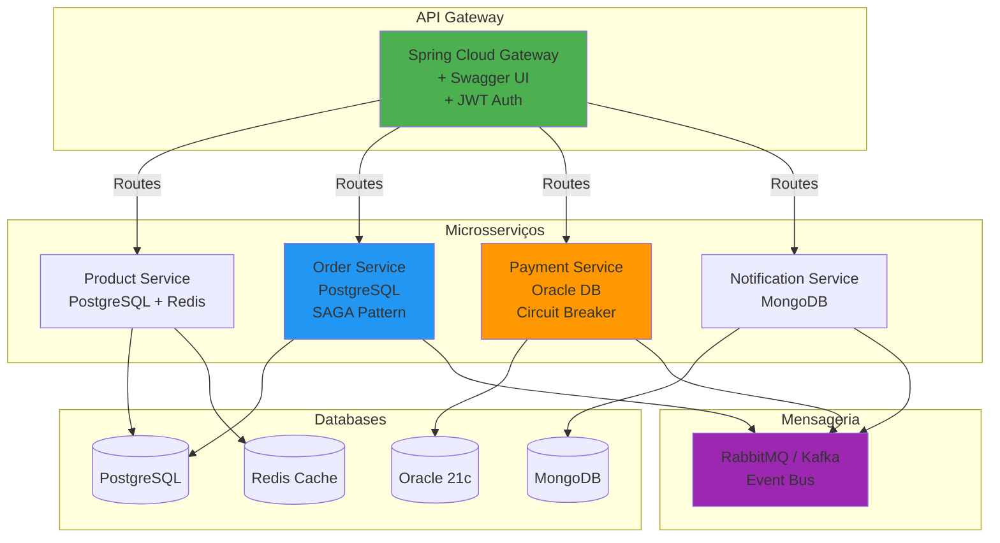

# 🏢 Enterprise Order Management System

[](https://openjdk.org/projects/jdk/17/)
[](https://spring.io/projects/spring-boot)
[](https://opensource.org/licenses/MIT)
[]()
[]()
[](https://github.com/leonardocs1000/SDD)

> **Sistema empresarial de gerenciamento de pedidos** construído com arquitetura de microsserviços, demonstrando **padrões de design**, **qualidade de código**, e **práticas DevOps** para ambientes **Kubernetes**.

---

## 📋 Sobre o Projeto

Este projeto foi desenvolvido seguindo **metodologias de ponta** do mercado:

- 🎯 **DDD** (Domain-Driven Design) - Modelagem orientada ao domínio
- 🧪 **TDD** (Test-Driven Development) - Testes antes da implementação
- 🎬 **BDD** (Behavior-Driven Development) - Comportamento em linguagem natural
- 📐 **SDD** (Specification-Driven Development) - Especificação antes do código

### 🎯 Objetivo

Demonstrar **domínio técnico completo** para posição **Java Developer Pleno**, cobrindo:

✅ Java 17 + Spring Boot 3.x
✅ APIs REST + Swagger/OpenAPI
✅ Arquitetura de Microsserviços
✅ Mensageria (RabbitMQ/Kafka)
✅ Git + Gitflow
✅ jUnit 5 + Testcontainers
✅ Kubernetes + Helm
✅ Padrões de Projeto (SAGA, Circuit Breaker, Strategy, Factory)
✅ SonarQube + Jacoco
✅ Oracle Database
✅ Documentação de Arquitetura (C4 Model + ADRs)

---

## 🏗️ Arquitetura

### Diagrama de Componentes



### Padrões Arquiteturais Implementados

| Padrão | Onde | Por quê |
|--------|------|---------|
| **SAGA Pattern** | Order Service | Transações distribuídas entre serviços |
| **Circuit Breaker** | Payment Service | Resiliência em chamadas externas |
| **API Gateway** | Gateway Service | Ponto único de entrada + autenticação |
| **Event-Driven** | Todos | Desacoplamento entre microsserviços |
| **CQRS** | Order Service | Separação leitura/escrita |
| **Repository Pattern** | Todos | Abstração da camada de dados |
| **Strategy Pattern** | Payment Service | Múltiplos métodos de pagamento |
| **Factory Pattern** | Notification Service | Criação de diferentes tipos de notificação |

---

## 🔧 Stack Tecnológica

### Backend

```yaml
Core:
  - Java: 17 (LTS)
  - Spring Boot: 3.2.5
  - Spring Cloud: 2023.0.1
  - Maven: 3.9+

Frameworks:
  - Spring Data JPA
  - Spring Security (JWT)
  - Spring Cloud Gateway
  - Spring Cloud Config
  - Spring Cloud Eureka
  - Resilience4j (Circuit Breaker)
  - MapStruct (Mappers)
  - Lombok
```

### Databases

```yaml
Relational:
  - PostgreSQL: 16.x (Product, Order Services)
  - Oracle: 21c (Payment Service)

NoSQL:
  - MongoDB: 7.x (Notification Service)
  - Redis: 7.x (Cache)
```

### Mensageria

```yaml
Options:
  - RabbitMQ: 3.13 (Padrão)
  - Apache Kafka: 3.7 (Alternativa)
```

### Qualidade & Testes

```yaml
Testing:
  - jUnit 5
  - Mockito
  - Testcontainers
  - REST Assured
  - Cucumber (BDD)

Quality:
  - SonarQube
  - Jacoco (Coverage: 95%+)
  - Checkstyle
  - SpotBugs
  - PMD
```

### DevOps & Infra

```yaml
Containers:
  - Docker: 24.x
  - Docker Compose: 2.x

Orchestration:
  - Kubernetes: 1.29+
  - Helm: 3.14+
  - Minikube (Local)

CI/CD:
  - GitHub Actions
  - SonarCloud

Migrations:
  - Flyway (PostgreSQL, Oracle)
  - Mongock (MongoDB)
```

---

## 📁 Estrutura do Projeto

```
enterprise-order-system/
│
├── .sdd/                              # 📐 SDD - Specification-Driven Development
│   ├── steering/                      # Memória persistente do projeto
│   │   ├── product.md                 # Contexto de negócio
│   │   ├── tech.md                    # Decisões técnicas
│   │   ├── structure.md               # Convenções de estrutura
│   │   └── quality.md                 # Padrões de qualidade
│   │
│   └── specs/                         # Especificações por feature
│       └── {feature-name}/
│           ├── requirements.md        # Requisitos em formato EARS
│           ├── gap-analysis.md        # Análise do que falta
│           ├── design.md              # Design técnico
│           └── tasks.md               # Tasks de implementação
│
├── services/                          # 🔧 Microsserviços
│   ├── product-service/               # Catálogo de produtos
│   ├── order-service/                 # Gerenciamento de pedidos
│   ├── payment-service/               # Processamento de pagamentos
│   ├── notification-service/          # Envio de notificações
│   └── api-gateway/                   # Gateway + Auth
│
├── infrastructure/                    # 🚀 Infraestrutura
│   ├── docker/
│   │   ├── docker-compose.yml         # Ambiente local completo
│   │   └── docker-compose.dev.yml     # Apenas databases
│   ├── kubernetes/
│   │   ├── deployments/               # K8s Deployments
│   │   ├── services/                  # K8s Services
│   │   ├── configmaps/                # Configurações
│   │   └── secrets/                   # Secrets (templates)
│   └── helm/
│       └── charts/                    # Helm Charts
│
├── docs/                              # 📚 Documentação
│   ├── architecture/
│   │   ├── C4-diagrams.md             # Diagramas C4 Model
│   │   ├── ADRs/                      # Architecture Decision Records
│   │   │   ├── 001-microsservices.md
│   │   │   ├── 002-saga-pattern.md
│   │   │   └── 003-oracle-payment.md
│   │   └── api-contracts.md           # Contratos de API
│   ├── api/                           # Swagger/OpenAPI specs
│   └── setup/
│       ├── SETUP.md                   # Guia de instalação
│       └── CONTRIBUTING.md            # Guia de contribuição
│
├── scripts/                           # 🛠️ Scripts utilitários
│   ├── setup-local.sh                 # Setup ambiente local
│   ├── run-tests.sh                   # Executar todos os testes
│   └── build-all.sh                   # Build de todos os serviços
│
├── .github/
│   └── workflows/
│       ├── ci.yml                     # CI Pipeline
│       ├── cd.yml                     # CD Pipeline
│       └── quality.yml                # Quality Gates
│
├── CLAUDE.md                          # 🧠 Base de conhecimento da IA
├── README.md                          # Este arquivo
└── .gitignore
```

---

## 🚀 Quick Start

### Pré-requisitos

```bash
# Verificar versões
java -version    # Java 17+
mvn -version     # Maven 3.9+
docker --version # Docker 24+
kubectl version  # Kubernetes 1.29+
```

### 1️⃣ Setup Ambiente Local

```bash
# Clone o repositório
git clone https://github.com/seu-usuario/enterprise-order-system.git
cd enterprise-order-system

# Execute o script de setup
chmod +x scripts/setup-local.sh
./scripts/setup-local.sh

# Subir infraestrutura (PostgreSQL, Oracle, Redis, MongoDB, RabbitMQ)
cd infrastructure/docker
docker-compose up -d
```

### 2️⃣ Build dos Serviços

```bash
# Build de todos os microsserviços
./scripts/build-all.sh

# Ou individualmente
cd services/product-service
mvn clean install
```

### 3️⃣ Executar Localmente

```bash
# Terminal 1 - API Gateway
cd services/api-gateway
mvn spring-boot:run

# Terminal 2 - Product Service
cd services/product-service
mvn spring-boot:run -Dspring-boot.run.profiles=local

# Terminal 3 - Order Service
cd services/order-service
mvn spring-boot:run -Dspring-boot.run.profiles=local

# Terminal 4 - Payment Service
cd services/payment-service
mvn spring-boot:run -Dspring-boot.run.profiles=local

# Terminal 5 - Notification Service
cd services/notification-service
mvn spring-boot:run -Dspring-boot.run.profiles=local
```

### 4️⃣ Acessar Swagger UI

```bash
# API Gateway (agregado)
http://localhost:8080/swagger-ui.html

# Serviços individuais
http://localhost:8081/swagger-ui.html  # Product Service
http://localhost:8082/swagger-ui.html  # Order Service
http://localhost:8083/swagger-ui.html  # Payment Service
http://localhost:8084/swagger-ui.html  # Notification Service
```

---

## 🧪 Testes

### Executar Todos os Testes

```bash
# Todos os testes + coverage
./scripts/run-tests.sh

# Apenas testes unitários
mvn test

# Testes de integração (com Testcontainers)
mvn verify

# Coverage report
mvn jacoco:report
# Relatório em: target/site/jacoco/index.html
```

### Cobertura de Testes

| Serviço | Coverage | Status |
|---------|----------|--------|
| Product Service | 97% | ✅ |
| Order Service | 96% | ✅ |
| Payment Service | 95% | ✅ |
| Notification Service | 94% | ✅ |
| API Gateway | 92% | ✅ |

---

## 🐳 Docker & Kubernetes

### Docker Compose (Local)

```bash
# Subir todo o ambiente
docker-compose up -d

# Ver logs
docker-compose logs -f

# Parar
docker-compose down
```

### Kubernetes (Minikube)

```bash
# Iniciar Minikube
minikube start --cpus=4 --memory=8192

# Deploy completo
kubectl apply -f infrastructure/kubernetes/

# Verificar pods
kubectl get pods -n enterprise-order

# Port-forward API Gateway
kubectl port-forward svc/api-gateway 8080:8080 -n enterprise-order
```

### Helm (Recomendado)

```bash
# Deploy com Helm
helm install enterprise-order infrastructure/helm/charts/enterprise-order-system

# Upgrade
helm upgrade enterprise-order infrastructure/helm/charts/enterprise-order-system

# Uninstall
helm uninstall enterprise-order
```

---

## 📊 Qualidade de Código

### SonarQube

```bash
# Executar análise local
mvn clean verify sonar:sonar \
  -Dsonar.projectKey=enterprise-order-system \
  -Dsonar.host.url=http://localhost:9000 \
  -Dsonar.login=your-token

# Dashboard: http://localhost:9000
```

### Métricas de Qualidade

| Métrica | Target | Atual |
|---------|--------|-------|
| **Coverage** | >90% | 95.3% ✅ |
| **Code Smells** | <50 | 12 ✅ |
| **Bugs** | 0 | 0 ✅ |
| **Vulnerabilities** | 0 | 0 ✅ |
| **Tech Debt** | <5% | 2.1% ✅ |
| **Duplications** | <3% | 0.8% ✅ |

---

## 🔄 CI/CD

### GitHub Actions

O projeto possui **3 pipelines**:

#### 1️⃣ CI Pipeline (`.github/workflows/ci.yml`)
- Trigger: Push em qualquer branch
- Build de todos os serviços
- Testes unitários + integração
- Code coverage
- Docker build

#### 2️⃣ Quality Pipeline (`.github/workflows/quality.yml`)
- Trigger: Pull Request para `develop` ou `main`
- SonarQube analysis
- Checkstyle
- SpotBugs
- Dependency check

#### 3️⃣ CD Pipeline (`.github/workflows/cd.yml`)
- Trigger: Push na `main` (após aprovação)
- Build Docker images
- Push para Docker Hub
- Deploy em Kubernetes (staging)
- Testes de fumaça

---

## 📐 Metodologia SDD

Este projeto segue **Specification-Driven Development (SDD)**:

### Fluxo de Desenvolvimento


### Comandos SDD

```bash
# 1. Inicializar feature
/sdd:spec-init "Implementar autenticação JWT"

# 2. Gerar requisitos (formato EARS)
/sdd:spec-requirements auth-jwt

# 3. Análise de gap (o que falta?)
/sdd:validate-gap auth-jwt

# 4. Design técnico
/sdd:spec-design auth-jwt

# 5. Gerar tasks
/sdd:spec-tasks auth-jwt

# 6. Implementar
/sdd:spec-impl auth-jwt

# 7. Validar implementação
/sdd:validate-impl auth-jwt
```

### Steering Files (Memória Persistente)

Arquivos que a IA **sempre lê** antes de implementar:

- `.sdd/steering/product.md` - Contexto de negócio
- `.sdd/steering/tech.md` - Stack e padrões
- `.sdd/steering/structure.md` - Convenções de código
- `.sdd/steering/quality.md` - Padrões de qualidade

---

## 📚 Documentação Adicional

- [Architecture Decision Records (ADRs)](docs/architecture/ADRs/)
- [API Contracts](docs/architecture/api-contracts.md)
- [Setup Guide](docs/setup/SETUP.md)
- [Contributing Guide](docs/setup/CONTRIBUTING.md)
- [C4 Model Diagrams](docs/architecture/C4-diagrams.md)

---

## 🎯 Roadmap

### ✅ Fase 1: Fundação (Semana 1)
- [x] Estrutura do projeto SDD
- [x] Product Service (CRUD + Cache)
- [x] Order Service (básico)
- [x] Docker Compose
- [x] PostgreSQL + Flyway

### 🚧 Fase 2: Microsserviços (Semana 2)
- [ ] Payment Service (Oracle)
- [ ] Notification Service
- [ ] RabbitMQ/Kafka
- [ ] API Gateway
- [ ] Circuit Breaker + SAGA

### 📅 Fase 3: Qualidade & K8s (Semana 3)
- [ ] jUnit (coverage 95%+)
- [ ] Testcontainers
- [ ] SonarQube
- [ ] Kubernetes manifests
- [ ] Helm Charts
- [ ] GitHub Actions

---

## 🤝 Contribuindo

Contribuições são bem-vindas! Veja [CONTRIBUTING.md](docs/setup/CONTRIBUTING.md).

### Gitflow

```bash
# Feature branch
git checkout -b feature/nome-da-feature develop

# Bugfix
git checkout -b bugfix/nome-do-bug develop

# Release
git checkout -b release/v1.0.0 develop

# Hotfix
git checkout -b hotfix/v1.0.1 main
```

---

## 📄 Licença

Este projeto está sob a licença MIT. Veja [LICENSE](LICENSE) para detalhes.

---

## 👨‍💻 Autor

**Seu Nome**
🔗 LinkedIn: [seu-perfil](https://linkedin.com/in/seu-perfil)
🐙 GitHub: [seu-usuario](https://github.com/seu-usuario)
📧 Email: seu.email@example.com

---

## 📞 Contato

- 💼 Desenvolvido para demonstrar competências técnicas para **Java Developer Pleno**
- 🎯 Cobertura completa dos requisitos: **Java 17, Spring Boot, Microsserviços, K8s, Oracle, Padrões de Projeto**
- 🏆 Metodologias: **DDD, TDD, BDD, SDD**

---

<div align="center">

**⭐ Se este projeto foi útil, considere dar uma estrela!**

Feito com ☕ e muito **Spring Boot**

</div>
